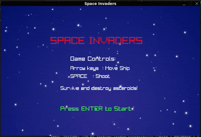

# Space Invaders (Go)

A modern interpretation of the classic Space Invaders game, built in Go using Raylib-go. This version embeds all game assets into a single executable for easy distribution.

## Description

This project is a recreation of the iconic Space Invaders arcade game using Go programming language. The game features a player-controlled spaceship that must defend Earth from waves of descending Asteroids.

## Features

- Dynamic difficulty: Asteroid fall rates increase over time.
- Embedded assets for a single-binary distribution.
- High score tracking.
- Sound effects and background music.
- Simple controls (arrow keys to move, space to shoot).


## Build & Run from Source
1. Clone the repository:
   ```bash
   git clone https://github.com/abhishekbrt/Space-invader.git
   cd Space-invader
   go mod tidy
   ```
2. Build the project:
   ```bash
   go build
   ```
3. Run the executable:
   ```bash
   ./Space-invader
   ```

## Demo
Short GIF  to showcase gameplay:


## Download Pre-Built Executables
Visit the Executables directory to download an executable for your operating system. After downloading, just run the file:
- On Windows: double-click the .exe file
- On Linux: make it executable (chmod +x Space-invader) then execute in a terminal.

## Controls

- Arrow Keys: Move the spaceship
- Space: Shoot
- Enter: Start game
- R: Restart after Game Over

## Gameplay
- Survive approaching asteroids and shoot them for points.
- You have 1 life. Collisions end the game.
- Difficulty increases every 30 seconds.

